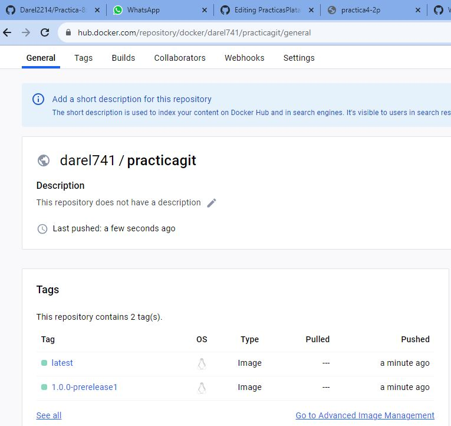
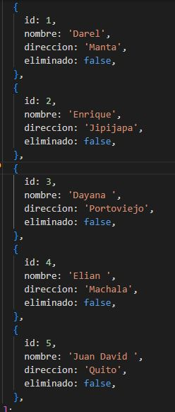
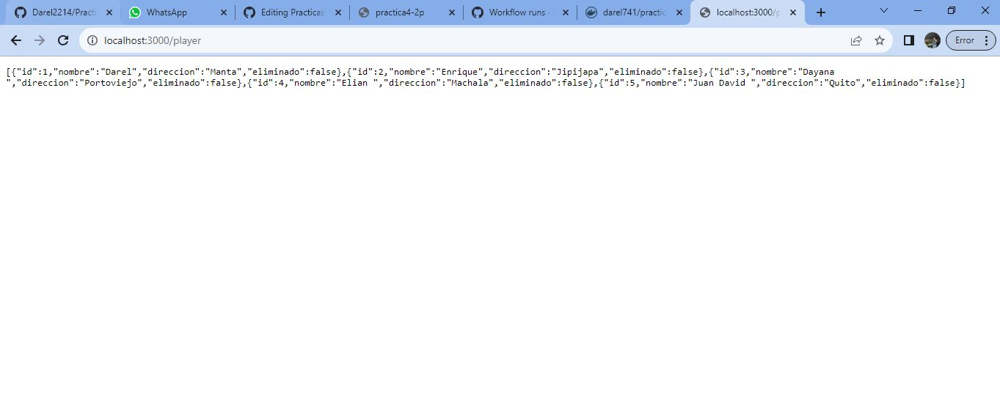
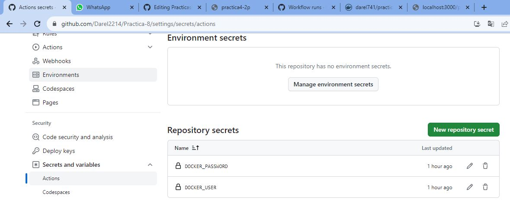
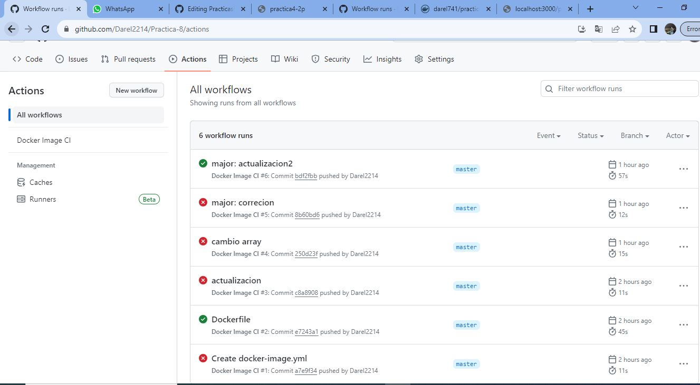
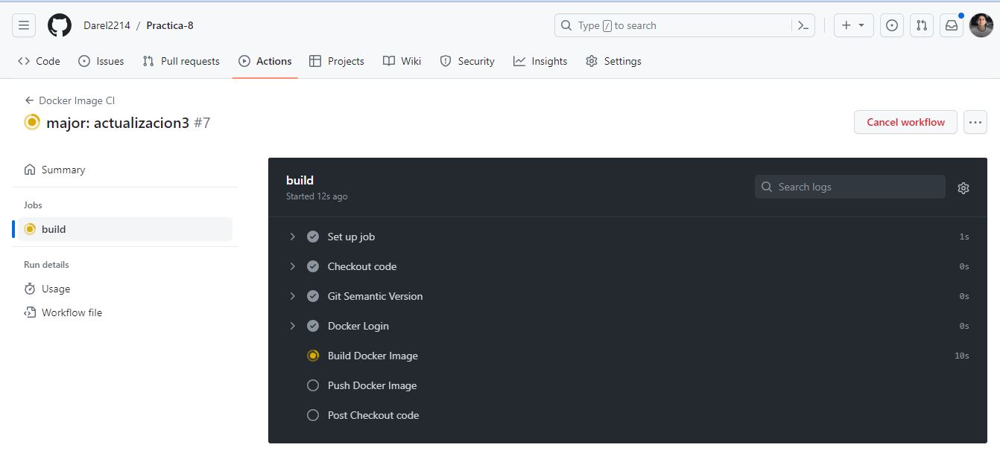
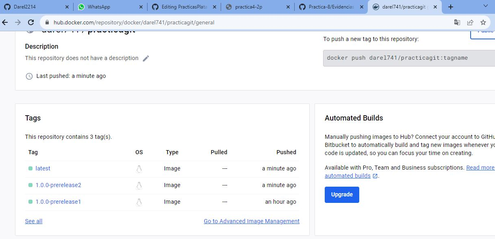

## Prueba

## Docker tags

## Array de datos

## Array LocalHost

## Github Los Secrets

## Github los Actions

## Para evidencia se creara un nuevo commit 
# en este commit se cambiara en el arreglo de datos esto hara que se cree una nueva imagen en nuestro docker hub

## Se muestra que se esta creando una nueva imagen

## Tambien se puede verificar desde nuestro Docker hub
